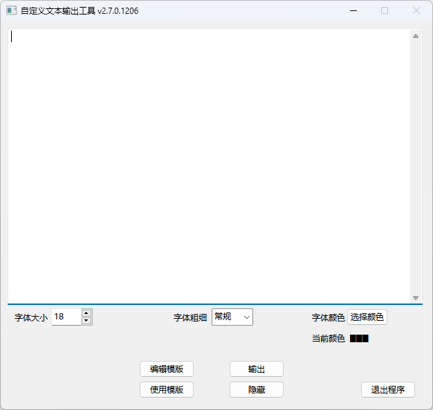

# <image src="Assets/icon-pic.png" height="45"/> 自定义文本输出工具

### Custom-Text-Display-Tool

#### 在 LCD 大屏顶端正中央输出自定义的文本，可用于显示提示信息、联系方式等。

 

 
主界面

 

 
输出窗口

 

## 提醒

1. 若要提出 Bug 或新功能建议，请通过[发起 `Issue` ](https://github.com/WilsonHuangDev/Custom-Text-Display-Tool/issues/new)使我知晓。当然，您也可以自行[创建 `Pull Request` ](https://github.com/WilsonHuangDev/Custom-Text-Display-Tool/pulls)修改。
2. 如有定制软件等特殊需求，请通过下方联系方式与我联系。
3. 对于本软件的使用方法，请参阅软件根目录或本仓库 `CustomTextDisplayTool` 目录下的[ `README.rtf` ](CustomTextDisplayTool/README.rtf)（`rtf` 文件无法使用文本查看器直接打开，请下载后使用 `Word` 等软件打开）。

## 联系方式

邮箱: 2068364343@qq.com

bilibili 主页：[点击访问](https://space.bilibili.com/1056060818)

## 仓库目录结构

> 1 [.github 文件夹](.github): Github 仓库 Issue 模版和工作流配置文件目录
>
> > 1.1 [ISSUE_TEMPLATE 文件夹](.github/ISSUE_TEMPLATE): Github 仓库 Issue 模版目录
> >
> > > 1.1.1 [BugReport.yml](.github/ISSUE_TEMPLATE/BugReport.yml): 有关 Bug 的 Issue 模版
> > > 
> > > 1.1.2 [FeatureRequest.yml](.github/ISSUE_TEMPLATE/FeatureRequest.yml): 有关新功能的 Issue 模版
> > > 
> > > 1.1.3 [OptimizationRequest.yml](.github/ISSUE_TEMPLATE/OptimizationRequest.yml): 有关功能优化的 Issue 模版
> > 
> > 1.2 [workflows 文件夹](.github/workflows): Github 仓库工作流配置文件目录
> > 
> > > 1.2.1 [defender-for-devops.yml](.github/workflows/defender-for-devops.yml): Microsoft Defender For Devops 工作流配置文件
> > >
> > > 1.2.2 [Python-Build.yml](.github/workflows/Python-Build.yml): Python Build and Release 工作流配置文件
> > >
> > > 1.2.3 [generate-sha256.ps1](.github/workflows/generate-sha256.ps1): Python Build and Release 工作流中计算 SHA-256 的脚本
>
> 2 [Assets 文件夹](Assets): 图片/图标目录
>
> > 2.1 [icon.ico](Assets/icon.ico): Logo Icon
> > 
> > 2.2 [icon-pic.png](Assets/icon-pic.png): Logo Picture
> >
> > 2.3 [app-image1.png](Assets/app-image1.png): 软件截图(主界面)
> >
> > 2.4 [app-image2.png](Assets/app-image2.png): 软件截图(输出窗口)
>
> 3 [CustomTextDisplayTool 文件夹](CustomTextDisplayTool): 本软件目录
>
> > 3.1 [Assets 文件夹](CustomTextDisplayTool/Assets): 软件配套图标目录
> >
> > > 3.1.1 [icon.ico](CustomTextDisplayTool/Assets/icon.ico): Logo Icon
> >
> > 3.2 [Bin 文件夹](CustomTextDisplayTool/Bin): 软件主体目录
> >
> > > 3.2.1 [_internal 文件夹](CustomTextDisplayTool/Bin/_internal): 软件运行库目录
> > >
> > > 3.2.2 [CustomTextDisplayTool.exe](CustomTextDisplayTool/Bin/CustomTextDisplayTool.exe): 软件可执行程序
> >
> > 3.3 [LICENCE.rtf](CustomTextDisplayTool/LICENCE.rtf): 软件开源许可证&版权
> >
> > 3.4 [README.rtf](CustomTextDisplayTool/README.rtf): 软件自述文档
>
> 4 [dist 文件夹](dist): 软件单文件版本构建目录
>
> > 4.1 [CustomTextDisplayTool.exe](dist/CustomTextDisplayTool.exe): 软件单文件版可执行程序
>
> 5 [NSIS 文件夹](NSIS): NSIS 软件及安装包打包脚本目录
> 
> > 5.1 [CustomTextDisplayTool.nsi](NSIS/CustomTextDisplayTool.nsi): 安装包打包脚本
> >
> > 5.2 [nsis-3.08-setup.exe](NSIS/nsis-3.08-setup.exe): NSIS 主程序安装包
> 
> 6 [CustomTextDisplayTool.py](CustomTextDisplayTool.py): 软件通用版源代码
> 
> 7 [CustomTextDisplayTool_bsdnsxx.py](CustomTextDisplayTool_bsdnsxx.py): 软件北师大南山附校定制版源代码
> 
> 8 [.gitignore](.gitignore): Git Ignore 配置文件
>
> 9 [LICENSE](LICENSE): 本仓库开源许可证&版权
>
> 10 [README.md](README.md): 本仓库说明文档

## 许可证

本项目基于 [MIT License](LICENSE) 获得许可。
